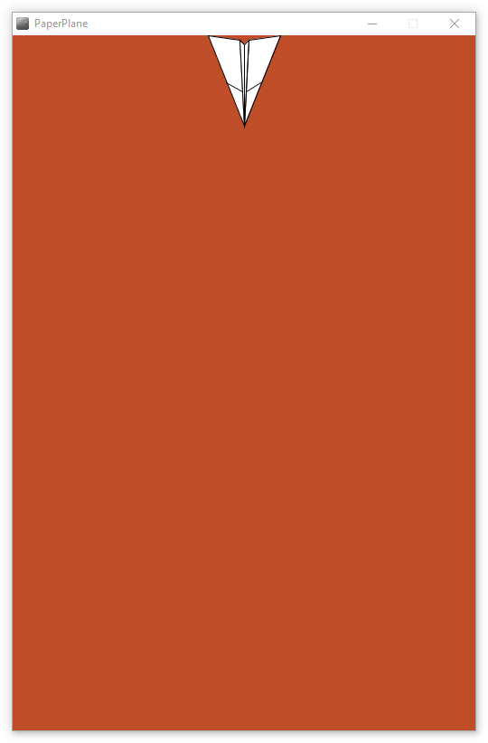

# Paper-Plane

Creating a 512 x 768 pixel window with a brown coloured background to simulate a building. There will then be a plane drawn with its shortest edge parallel to the top border in the center of the screen. It should be fully visible at the very top of the screen.

After the plane is drawn it should slowly move down the screen to the bottom, it will continue off the screen. Pressing any key will reset the plane to the top of the screen

Screenshot
----

